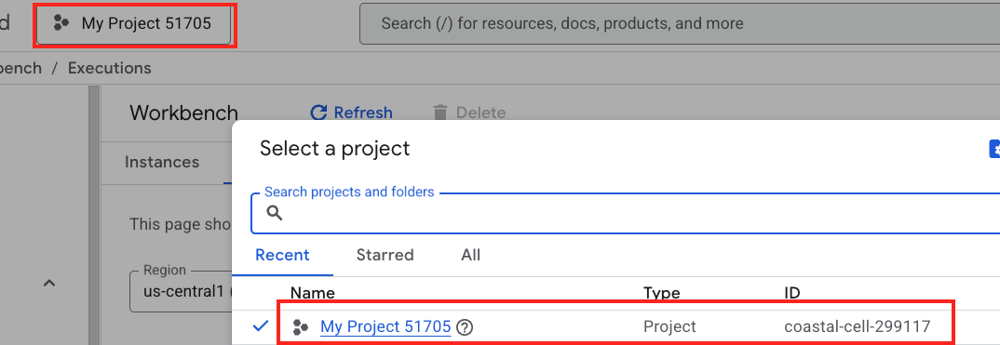

Please find the `DOCKER_PASSWORD` and `DOCKER_USERNAME`, `GCP_PROJECT_ID`, `GCP_SA_KEY`

GCP_SA_KEY - go to service account in GCP and choose the service account that has admin permission, then, create a key in `JSON` format. Copy and paste this JSON as `GCP_SA_KEY`

`GCP_PROJECT_ID`

At the end of the exercise you should be able to see your app deployed.

Don't forget to delete the app after the exercise to avoid any charges.