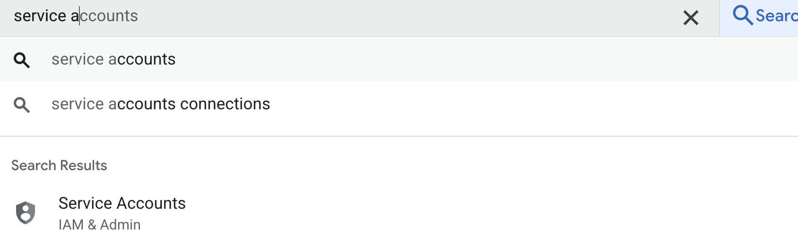
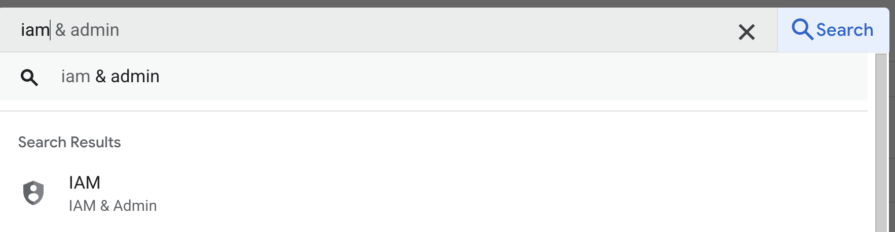

Step 1: Create service account
Create a service account by searching `Service Accounts`

name e.g. `simple-vertex-ai-account`
description e.g. `vertex-ai tutorial with Mew`

Step 2: Adding permission to the service account
Next search to `IAM`

you should see your service account being added.

Next Add permission to the service account. Basic -> Owner.

Step 3: Create a cloud object storage
If not already create a cloud object storage bucket called `simple-vertex-ai-pipeline`

Step 4: Import notebook, add in your variables and run it.