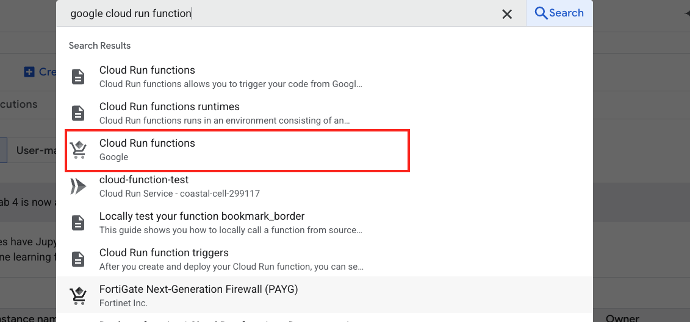
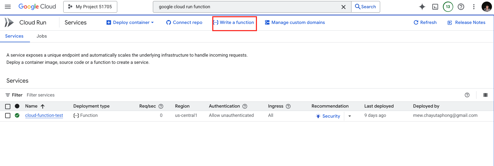
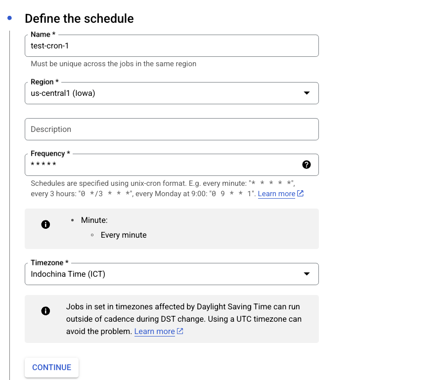
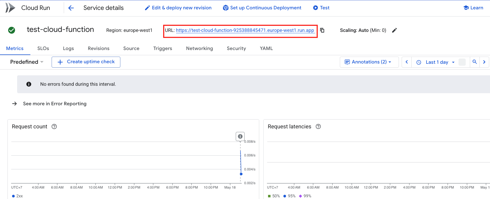
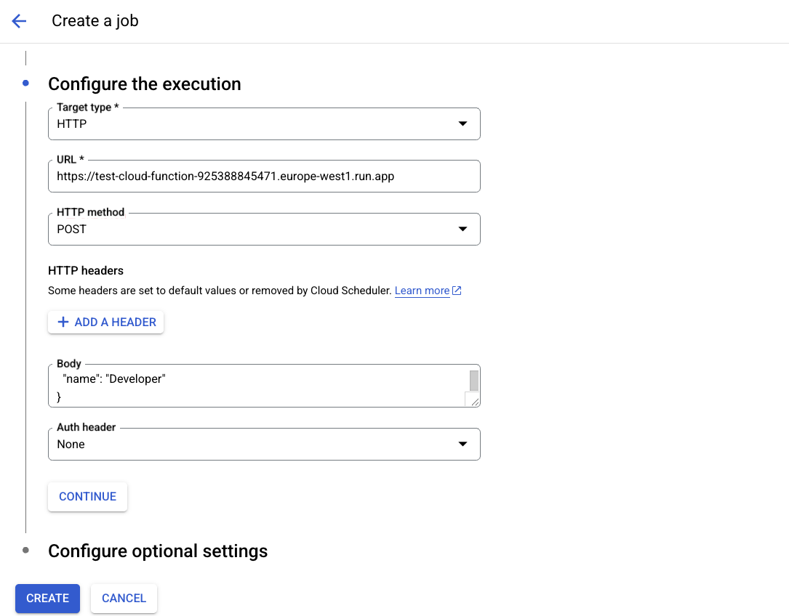
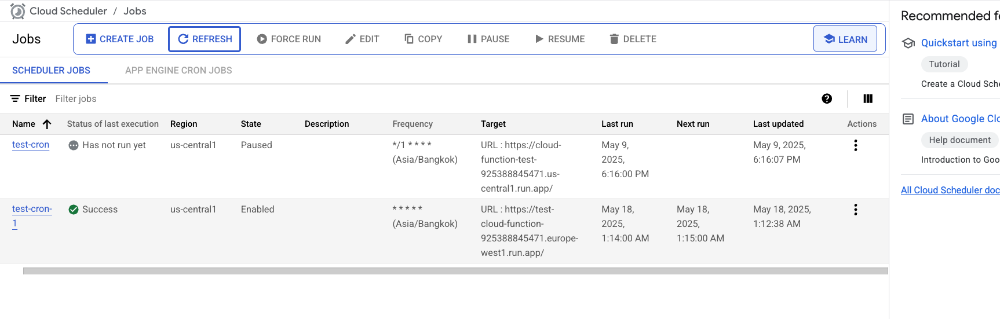
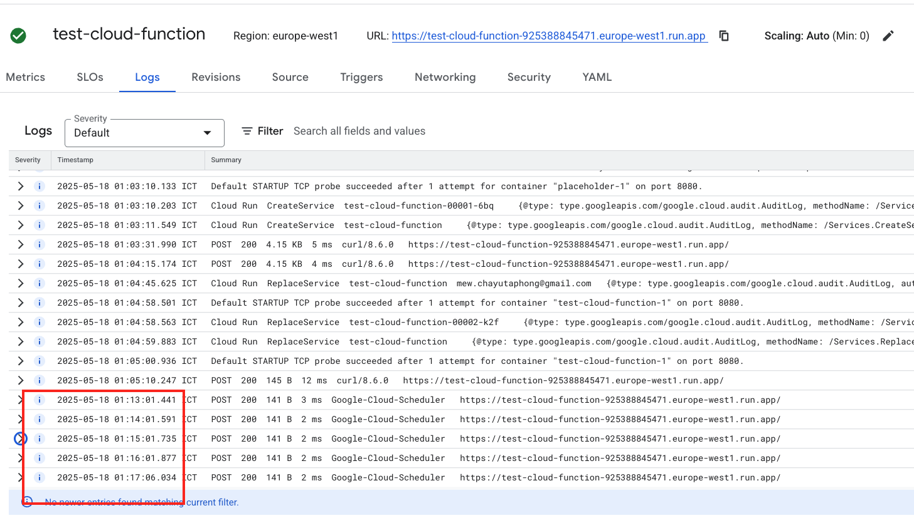

1. First open google cloud run functions


2. Then create a function.



3. Click on Save and Deploy or edit and deploy


4. Click on Test and copy the curl command and try it.
The curl comand will look something like this:

```
curl -X POST https://yoururl \
-H "Authorization: bearer $(gcloud auth print-identity-token)" \
-H "Content-Type: application/json" \
-d '{
  "name": "Developer"
}'
```

It should give you a response.

5. Let's go to `cloud scheduler`

We will trigger the cloud function every minute

6. Fill in the form


Copy this




After successfully running, it should show up as successful.


Logs Can be found in the cloud function.
