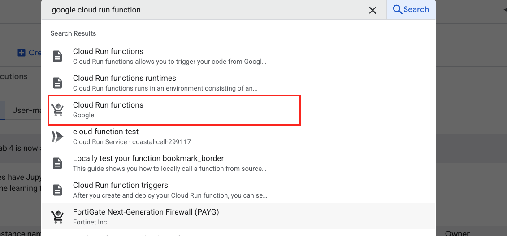

Here is the second way to schedule tasks in google cloud platform.

Execute this every one hour.

You should see the task is being scheduled.

The result of the execution could be seen in the `execution tab